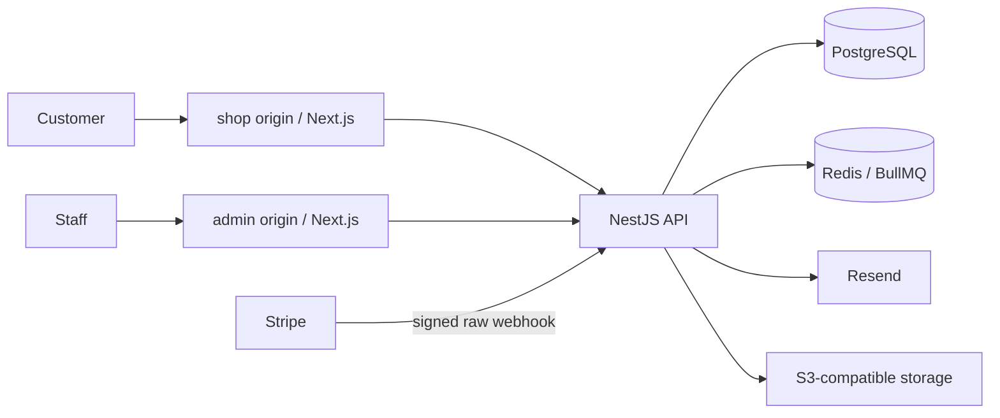

# Architecture

Exactly three deployable application services: web and admin (Next.js App Router), API (NestJS/Express modular monolith). PostgreSQL, Redis/BullMQ and object storage are infrastructure. Job consumers and the periodic dispatcher live inside API replicas; there is no fourth worker application.

Only the API imports database and secret-bearing integration packages. `contracts` holds validated inputs and public DTOs; `api-client` implements those contracts with relative `/api` browser calls. Its separate `./proxy` entrypoint is exclusively a server route helper. `ui` supplies tokens, primitives and the accessible Radix size dialog. `email` supplies React Email HTML/text templates. Configuration packages share strict TypeScript and ESLint defaults.

Both frontends implement a bounded streaming API proxy that strips untrusted routing headers and supplies a server-only shared proxy secret and exact configured origin. Cookie and individual Set-Cookie headers are forwarded. Commerce mutations require the incoming Origin to match the trusted frontend origin. Better Auth is initialized and mounted only in the API before JSON parsing. Webhooks use a dedicated raw-body route. Public catalog rendering is server-side and uncached initially, so edits appear on the next request without invalidation races. Private data is always uncached. Interactive data uses TanStack Query.

For production use the reverse-proxy template in `ops/nginx.conf.template`: terminate TLS, send trusted routing headers, pass client IP from the network peer, and keep the API on an internal network. The Next.js proxy's development fallback uses an aggregate IP identifier, rather than trusting client-supplied forwarded IP headers.

Modules keep controllers thin and transaction rules in catalog, carts, checkout, payment and order services. Account and staff authorization always reloads current database state. Roles are server-set CUSTOMER, STAFF and OWNER. OWNER bootstrap and sensitive staff/refund/policy actions are audited; sensitive actions require a session created in the last five minutes.

Local object storage is MinIO in Compose, with a persistent volume and an idempotent one-shot bucket initializer; it is infrastructure, not a fourth application. See [MinIO configuration](minio.md).
